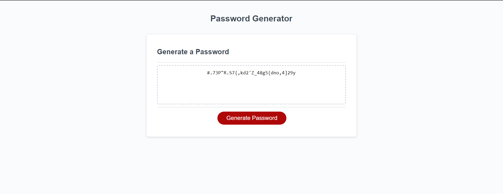

# Password-Generator
Challenge 3 for the UTA FSF Web Development bootcamp, where the goal is to generate a random password.

## Description
The problem in Challenge Three is to create a webpage that generates a password, which follows rules according to the user's input. The user can set the password length between 8 and 128 characters long, and decide whether or not they want lowercase characters, uppercase characters, numbers, and/or symbols in their password.

## Preview

## Usage
To view the webpage, go to https://allenwang1999.github.io/Password-Generator using your browser and follow the prompts that appear on the screen after clicking the <Generate Password> Button.

## License
MIT License; refer to the <a href="LICENSE">LICENSE</a> file in the repo.
